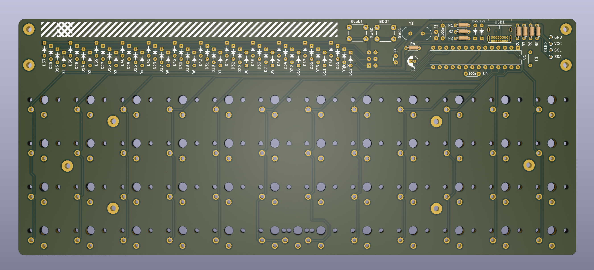

Plaid-Choc
=================

## As of 8/02/24 this is still untested and should not be used to generate gerbers without due care.

Choc spaced version of Plaid - a 4x12 ortholinear keyboard kit made by through hole components only.

This version supports choc V1 switches only. 

This is forked from an updated version modified to use USB-C instead of Mini USB by piit79.

Atmega328p with VUSB on [QMK firmware](https://github.com/qmk/qmk_firmware).

[Build guide and bom is here](./doc)
[ビルドガイドとパーツリストはこちら](./doc)
